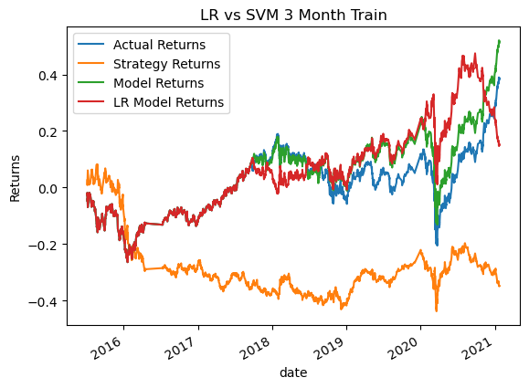

# Machine_Learning_Trading_Bot

In this notebook I test two machine learning models (SVC and LogisticRegression) against a hardcoded Simple Moving Average (SMA) trading algorithm. I then experiment with the models to increase their returns.

---

## Technologies

This code was written on Windows 11 running python 3.8.13. It also uses Pandas (Version 1.3.5), Scikit_learn (Version 1.0.2), Numpy (Version 1.21.5 and Matplotlib (Version 3.5.1)

---

## Installation Guide

All required packages can be installed with pip install.

---

## Experiment

This notebook was made to practice developing and improving trading algorithms. Currently, the notebook is set to run a moving average trading strategy. The short moving average is set to 4 and the long moving average is set to 100. The notebook also has a machine learning training dataset comprising 12 months of stock data.

These parameters can be adjusted by altering the variables 'short_window', 'long_window', and the DateOffset in variable 'training_end'.

Originally, the notebook was set with the same moving average but had a shorter 3 month training period. Here are the results.

'Actual Returns' represents what the market did on its own. 'Strategy Returns' represents the hard-coded SMA 

---

## Contributors

Garrett Hernandez -gtkhhz@gmail.com

---

## License

This is free and unencumbered software released into the public domain.

Anyone is free to copy, modify, publish, use, compile, sell, or
distribute this software, either in source code form or as a compiled
binary, for any purpose, commercial or non-commercial, and by any
means.

In jurisdictions that recognize copyright laws, the author or authors
of this software dedicate any and all copyright interest in the
software to the public domain. We make this dedication for the benefit
of the public at large and to the detriment of our heirs and
successors. We intend this dedication to be an overt act of
relinquishment in perpetuity of all present and future rights to this
software under copyright law.

THE SOFTWARE IS PROVIDED "AS IS", WITHOUT WARRANTY OF ANY KIND,
EXPRESS OR IMPLIED, INCLUDING BUT NOT LIMITED TO THE WARRANTIES OF
MERCHANTABILITY, FITNESS FOR A PARTICULAR PURPOSE AND NONINFRINGEMENT.
IN NO EVENT SHALL THE AUTHORS BE LIABLE FOR ANY CLAIM, DAMAGES OR
OTHER LIABILITY, WHETHER IN AN ACTION OF CONTRACT, TORT OR OTHERWISE,
ARISING FROM, OUT OF OR IN CONNECTION WITH THE SOFTWARE OR THE USE OR
OTHER DEALINGS IN THE SOFTWARE.

For more information, please refer to <https://unlicense.org>
